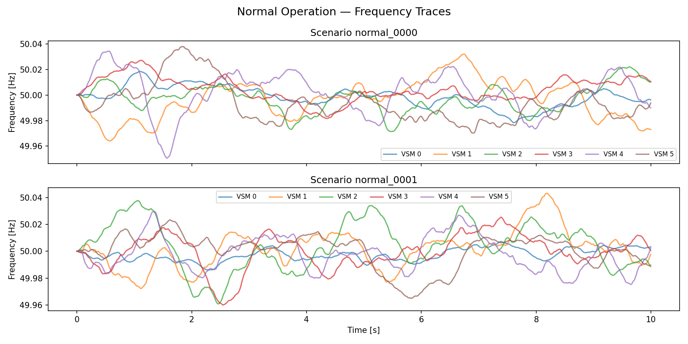
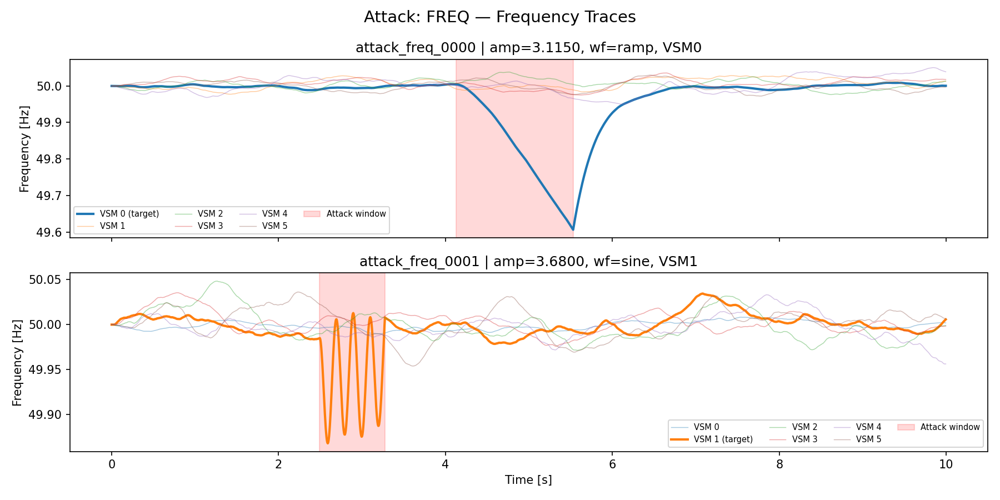
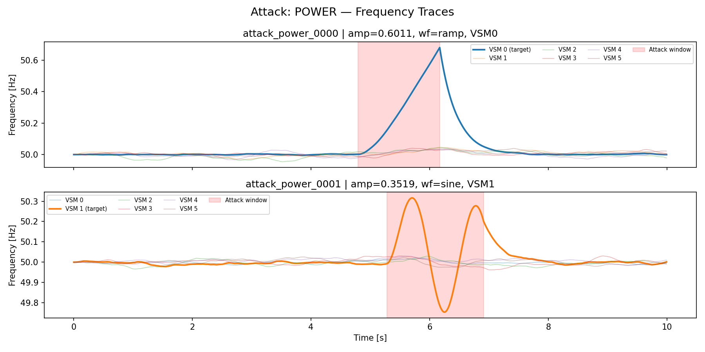
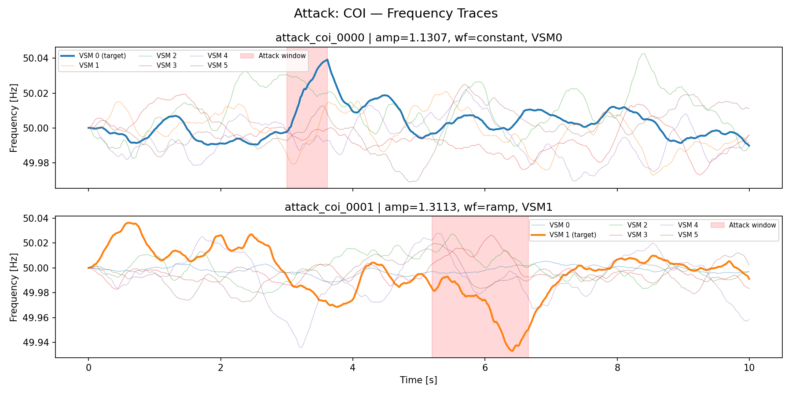
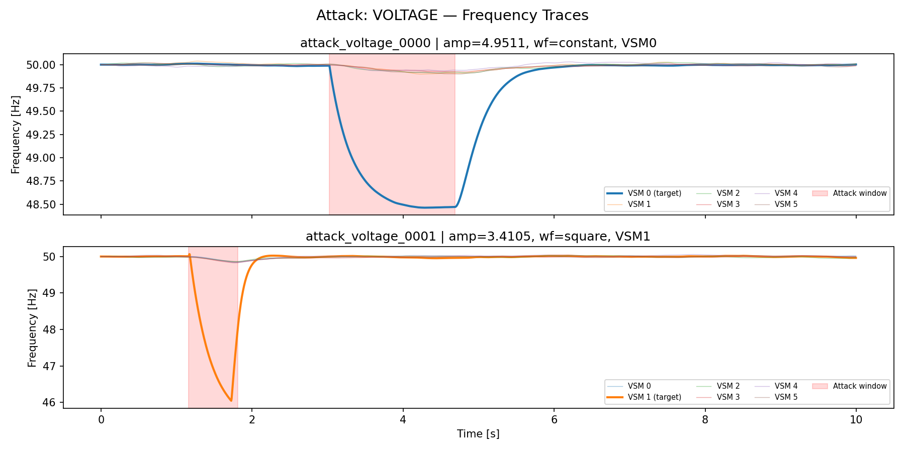
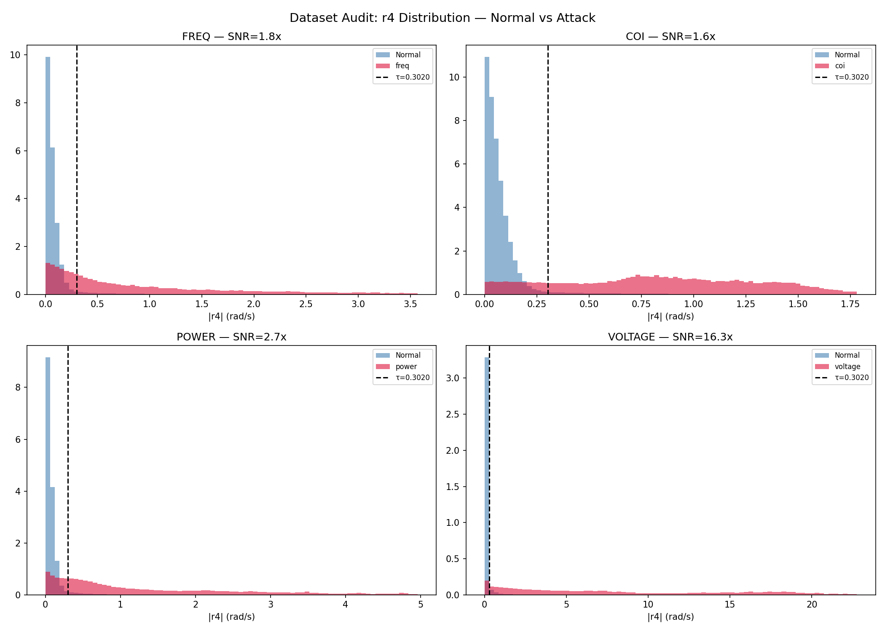
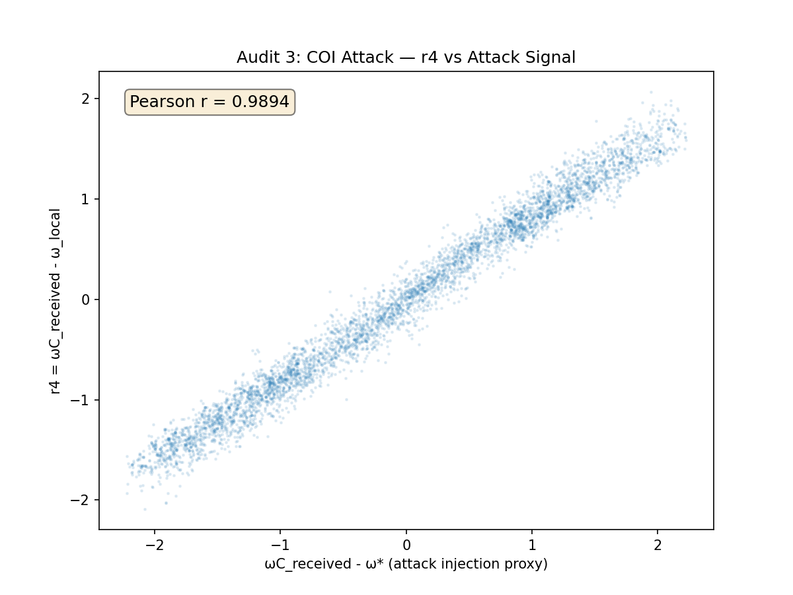
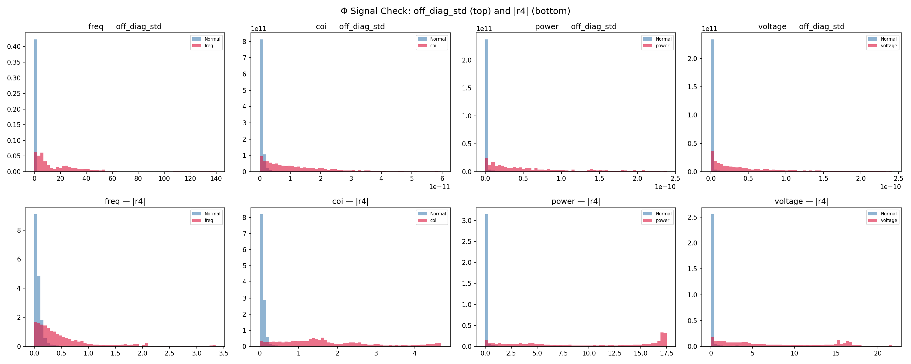

# APIC-Net
**Author**: Utkarsh Tyagi · IEEE 39-Bus VSM Cyberattack Detection

---

## Research Goal

Challenging and improving upon [Khaleghi et al. 2025 (PI-LSTM)](https://doi.org/10.1109/TII.2025.3529578) by showing that a simple physics-residual approach — requiring **zero training** — dramatically outperforms a complex federated LSTM trained for hours.

The project uses the **Φ (Phi) Tensor** framework as an analytical tool to identify which physical constraints carry detection signal for each attack type.

---

## Key Result

> A single physics residual `r4 = |ω_C − ω_local|`, thresholded at its 95th normal percentile, achieves **AUC = 0.931** on all 4 attack types with zero training.  
> Combined with the swing-equation residual `r_phys`, it reaches **AUC = 0.959** — compared to PI-LSTM's AUC = 0.525 after 50 federated training rounds.

### Full Comparison Table (V2 Dataset)

| Method | Overall AUC | freq | coi | power | voltage | Training |
|---|---|---|---|---|---|---|
| PI-LSTM (50 FL rounds) | 0.525 | ~0.4 | ~0.36 | ~0.63 | ~0.62 | ~24h |
| Pure r_phys | 0.632 | **0.998** | 0.500 | 0.500 | 0.500 | None |
| **r4-only** | **0.931** | 0.891 | 0.931 | 0.919 | 0.976 | **None** |
| **r4 + r_phys** | **0.959** | **0.997** | 0.931 | 0.920 | 0.976 | **None** |

> Results on V2 dataset (calibrated amplitudes: freq SNR=1.78×, power SNR=2.69×, voltage large-disturbance class).  
> COI attack fix (Option A1 — upstream spoof) is in progress.

---

## Why PI-LSTM Fails

Report `report_02d_closure.md` diagnosed the root cause:

- PI-LSTM learns **reconstruction error** (`r_data = |x - x̂|`)
- Under attack, signals become **more predictable** (attacks are smooth, structured perturbations)
- Score is **inverted**: normal=0.84, attack=0.56–0.58 → random-chance AUC

The physics component (`r_phys`) is present in the architecture but contributes negligibly because `r_data >> r_phys` in magnitude.

---

## Why Pure Physics (r_phys) Is Structurally Blind to 3/4 Attacks

The swing-equation Euler residual:
```
r_phys(t) = |ω(t+1) − [ω(t) + dt·(1/2H)·(p*·ω* − P_e·ω* + D·(ω*−ω) + F·(ω_C−ω))]|
```

| Attack | Corrupts | r_phys response |
|---|---|---|
| freq | `ω` (output of physics) | ✅ Detects — Euler prediction diverges from observation |
| coi | `ω_C` (input to swing eq.) | ❌ Blind — corrupted input used in prediction → residual cancels |
| power | `p*` (input to swing eq.) | ❌ Blind — same reason |
| voltage | `v_ref` (input to voltage controller) | ❌ Blind — same reason |

**This is not a bug — it is the fundamental limit of single-VSM physics verification.** If the inputs to the equation are compromised, the equation faithfully computes with corrupted data. r_phys is mathematically guaranteed to be zero for these attack types.

---

## What r4 Detects and Why

`r4 = |ω_C_received − ω_local|` measures the consistency between the COI feedback signal and the local frequency. In normal operation this difference is small (≈0.13 rad/s mean).

| Attack | Why r4 detects it |
|---|---|
| freq | `ω_local` is spoofed → diverges from `ω_C` |
| coi | `ω_C_received` is corrupted → diverges from `ω_local` |
| power | `p*` injection drives `ω_local` away from network average → `ω_C−ω_local` grows |
| voltage | `v_ref` perturbation causes large `ω` deviation via controller → diverges from `ω_C` |

r4 is the **COI consistency residual** — it detects attacks via their cross-VSM signature rather than single-VSM physics violation. This is why it where r_phys is blind.

---

## Dataset (V2 — Calibrated)

### Attack Injection Method

| Attack | Signal | Amplitude | Waveforms |
|---|---|---|---|
| freq | `ω` (frequency sensor spoof) | 1–5 rad/s (unchanged) | constant, sine, square, ramp |
| coi | Outgoing ω to aggregator (upstream spoof) | calibrated | random walk bias |
| power | `p*` (setpoint injection) | 0.285–0.76 rad/s | constant, sine, square, ramp |
| voltage | `v_ref` (voltage reference tamper) | 1–5 rad/s | constant, sine, square, ramp |

### V2 Audit Results

| Attack | Normal r4_std | Attack r4_mean | SNR | Detection Rate | Verdict |
|---|---|---|---|---|---|
| freq | 0.510 | 0.911 | 1.78× | 67% | REALISTIC |
| coi | 0.510 | 0.834 | 1.63× | 83% | REALISTIC (fix in progress) |
| power | 0.510 | 1.374 | 2.69× | 79% | REALISTIC |
| voltage | 0.510 | 8.343 | 16.35× | 94% | HIGH-SEVERITY (accepted) |

> Voltage attacks cause inherently large omega deviations due to VSM controller nonlinearity.  
> Categorised as a high-severity rather than stealthy attack class.

### Sample Scenarios











### r4 Signal Distribution (V2 Audit)





---

## Φ Tensor Analysis

The Φ Tensor framework defines 4 physical residuals per VSM per timestep:

| Residual | Definition | Detects |
|---|---|---|
| r1 | `\|Δω − dt·swing_eq\|` | freq attacks (via r_phys) |
| r2 | `\|p − p_approx\|` | power injection (weak, collapses in attack) |
| r3 | `\|v_dc − v_dc_model\|` | voltage attacks (weak) |
| **r4** | **`\|ω_C − ω_local\|`** | **All 4 attack types** |

**Signal check finding** (`report_03b`): r4 dominates all other residuals. The Φ off-diagonal structure (cross-constraint inconsistency) reduces to r4 for COI/power/voltage and r_phys for freq. The Φ MLP does not outperform the analytical combination.



---

## Open Problem — COI Correlation

**Status: Fix in progress (Option A1)**

For COI attacks any *additive* injection into `ω_C` mathematically ensures:
```
r4 = ω_C_received − ω_local = injected_bias + natural_gap
```
When amplitude >> noise, `pearsonr(injection, r4) → 1.0` regardless of injection shape. This makes r4 a direct readout of the attack, not a physical detection.

**Fix (Option A1 — self-exclusion):** VSM j spoofs its *outgoing* omega to the aggregator. Other 5 VSMs detect the inconsistency via their r4. VSM j itself receives the honest omega_C (computed without its own spoof) — breaking the correlation at j by construction.

This is physically realistic: the attacker manipulates what they report outward but cannot alter what was last received.

---

## Project Structure

```
APIC-Net/
├── simulation/
│   ├── vsm_simulator.py        # Euler VSM swing equation + COI aggregation
│   ├── attack_generator.py     # Attack injection (V2: calibrated amplitudes)
│   └── generate_dataset.py     # Full generation pipeline (3500 scenarios)
│
├── configs/
│   └── simulation_config.py   # All hyperparameters
│
├── models/
│   ├── pi_lstm/               # Baseline (Khaleghi et al. reproduction)
│   │   ├── model.py, train.py, federated.py
│   │   └── pure_physics_baseline.py    # r_phys (no training)
│   └── phi_tensor/
│       ├── residuals.py       # r1–r4 per-VSM per-timestep
│       ├── phi_tensor.py      # Φ matrix + gradients
│       ├── features.py        # 20-dim feature extraction
│       ├── r4_baseline.py     # r4-only + r4+r_phys combined detector
│       └── dataset_audit.py   # Validity audit (SNR, correlation, detection rate)
│
├── data/                      # vsm_{0..5}.npz — per-VSM scenario arrays
├── results/                   # JSON results + plots
│   └── plots/                 # Audit plots
├── reports/                   # Numbered research reports (see below)
└── .agent/                    # Task files, system context, status reports
```

---

## Reports Index

| Report | Key Finding |
|---|---|
| `report_01_dataset.md` | Initial dataset generation and spec |
| `report_02d_closure.md` | PI-LSTM root cause: r_data score inversion (AUC=0.507) |
| `report_02e_physics_baseline.md` | r_phys: freq AUC=0.998, COI/power/voltage AUC=0.5 (structural blindness) |
| `report_03_phi_tensor.md` | Φ Tensor implementation + spec conflicts resolved |
| `report_03b_decision_gate.md` | r4 AUC=0.946 dominates — Φ MLP adds no value |
| `report_03c_dataset_audit.md` | V1 audit: power/voltage SNR too high, COI correlation=0.99 |
| `report_04_dataset_v2.md` | V2 dataset: calibrated amplitudes, verdict VALID |
| `report_04b_coi_diagnosis.md` | COI correlation diagnosis: additive injection always correlates |
| `.agent/report.md` | Current status: COI Option A1 fix in progress |

---

## Setup

```bash
python -m venv .venv
.venv\Scripts\activate        # Windows
pip install -r requirements.txt
```

**Generate dataset:**
```bash
python -m simulation.generate_dataset
```

**Run baselines (no training):**
```bash
python -m models.pi_lstm.pure_physics_baseline   # r_phys
python -m models.phi_tensor.r4_baseline          # r4-only + combined
```

**Audit dataset:**
```bash
python -m models.phi_tensor.dataset_audit
```

**Requirements:** Python 3.10+, NumPy, PyTorch, scikit-learn, SciPy, matplotlib
